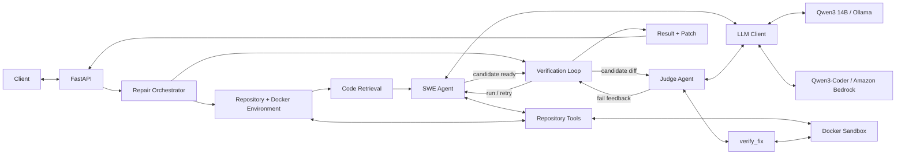

# swe_agent 

`swe_agent` is a repository-level software-repair agent that takes a Git repository and an issue description, retrieves relevant code, edits the repository through bounded tools, verifies candidate fixes inside Docker, and produces a Git patch with recorded run artifacts.

The system uses a separate judge agent and independently re-tests generated patches against both the original and modified repository state.

**Recorded local evaluation:** **11/18 independently verified repairs (61.1%)** across six small controlled bug-fixing tasks, with each task repeated three times.

> The included benchmark is a project-specific evaluation suite, not SWE-bench.

## Key features

- repository-aware code retrieval using Tree-sitter, embeddings, lexical search, and reranking
- explicit read, search, edit, and command-execution tools for the repair agent
- Docker-based runtime isolation with network access disabled and resource restrictions
- verification against both the original and patched repository
- a separate judge agent for candidate review
- independent evaluation that re-applies and re-tests generated patches
- local inference through Ollama
- hosted inference through Amazon Bedrock
- asynchronous FastAPI job API
- recorded patches, run metadata, and evaluation results

## Architecture



The repair pipeline handles repository preparation, code retrieval, tool execution, Docker-based testing, verification, and patch generation.

A shared `LLMClient` abstraction supports two inference configurations:

- **Local development and evaluation:** Qwen3 14B through Ollama
- **AWS deployment:** Qwen3-Coder-30B-A3B-Instruct through Amazon Bedrock

The recorded benchmark results in this repository were produced with the local Qwen3 14B configuration. They do not measure the Bedrock deployment.

## How it works

A repair run follows a bounded workflow:

1. Clone or copy the target repository into a temporary workspace.
2. Prepare a repository-specific execution environment.
3. Parse and index the repository.
4. Retrieve code relevant to the supplied issue.
5. Let the SWE agent inspect, search, edit, and test the repository through explicit tools.
6. Require command-based verification after modifications.
7. Pass the candidate patch and evidence to a separate judge agent.
8. Re-run the selected verification command against the original and patched repository.
9. Save the run result and generated Git diff as artifacts.

The agent primarily interacts with repository files through explicit read, search, and edit tools.

Commands requested by the agent are executed inside a restricted Docker runtime rather than directly on the host.

## Repository context and retrieval

Instead of placing the entire repository into the model context, the retrieval pipeline combines multiple signals:

- Tree-sitter parsing for Python, JavaScript, TypeScript, Java, C, C++, Go, Rust, and C#
- semantic embeddings using `sentence-transformers/all-MiniLM-L6-v2`
- Chroma vector search
- lexical search
- heuristic symbol and call-pattern expansion
- weighted retrieval and reranking
- bounded context assembly

This provides the model with a smaller set of issue-relevant code while retaining useful structural relationships around retrieved symbols.

The call-pattern expansion is intentionally heuristic; it is not a full language-aware static call-graph implementation.

## Runtime sandbox

Agent command execution and verification run inside Docker with restricted runtime settings, including:

- network access disabled
- read-only container root filesystem
- dropped Linux capabilities
- `no-new-privileges`
- PID limits
- CPU limits
- memory limits
- temporary writable storage through `tmpfs`

The target repository is mounted into the container so that tests and verification commands can execute against it.

### Trust boundary

Repository-specific dependency installation happens earlier while the execution image is being prepared.

That build step is a separate trust boundary from the restricted runtime container. Package installation and repository build scripts may execute code during image construction, and dependency resolution may require network access.

The runtime restrictions therefore reduce the capabilities available to commands executed during agent operation and verification, but **image construction should not be treated as a security boundary for arbitrary untrusted repositories**.

## LLM backends

The SWE agent and judge share the same `LLMClient` abstraction.

| Mode | Backend | Model |
| --- | --- | --- |
| Local development / evaluation | Ollama | `qwen3:14b` |
| AWS deployment | Amazon Bedrock | `qwen.qwen3-coder-30b-a3b-v1:0` |

The active backend is selected through `SWE_LLM_BACKEND`.

### Linux/macOS

For local inference:

```bash
export SWE_LLM_BACKEND=ollama
```

For Bedrock:

```bash
export SWE_LLM_BACKEND=bedrock
```

### PowerShell

For local inference:

```powershell
$env:SWE_LLM_BACKEND = "ollama"
```

For Bedrock:

```powershell
$env:SWE_LLM_BACKEND = "bedrock"
```

The Bedrock deployment additionally configures the AWS region and model identifiers.

The EC2 deployment uses an IAM role for Bedrock access rather than storing static AWS credentials in the application configuration.

## Evaluation

The repository includes a small controlled benchmark for measuring the repair pipeline.

The benchmark contains **six bug-fixing tasks**, with each task executed three times for a total of **18 repair attempts**.

For every attempt, the evaluation harness:

1. checks out an exact starting commit
2. confirms that the baseline checker fails
3. runs the repair agent
4. captures the generated Git patch
5. creates a fresh checkout
6. applies the generated patch independently
7. executes an independent checker inside a restricted Docker container

The primary benchmark result is therefore determined by the independent checker rather than by the judge agent's own verdict.

### Evaluation configuration

```text
Agent model:      qwen3:14b
Judge model:      qwen3:14b
Embedding model:  sentence-transformers/all-MiniLM-L6-v2
Attempts:         18
Time budget:      900 seconds per attempt
```

### Results

| Task | Independent passes | Attempts |
| --- | ---: | ---: |
| `config-defaults` | 0 | 3 |
| `csv-output` | 0 | 3 |
| `inventory` | 3 | 3 |
| `merge-intervals` | 3 | 3 |
| `page-tokens` | 3 | 3 |
| `tag-order` | 2 | 3 |
| **Total** | **11** | **18** |

Across all 18 attempts:

- **11** passed the independent checker
- **6** failed the independent checker
- **1** produced a checker error

The resulting independent-checker pass rate is:

**61.1% (11/18)**

The judge agent frequently failed to return a complete usable verdict during this evaluation:

- incomplete verdict: 12 attempts
- `pass`: 2 attempts
- `fail`: 1 attempt
- no verdict: 3 attempts

Because of this, the benchmark deliberately treats independently re-applied and re-tested patches as the primary measurement rather than relying on the judge's self-reported result.

### Scope of the benchmark

These tasks are small, controlled repository repairs.

They are **not SWE-bench tasks**, and the 61.1% result should not be interpreted as a general software-engineering-agent success rate or compared directly with SWE-bench scores.

Aggregate results and the evaluation manifest are stored under:

```text
evaluation-results/
```

### Reproducibility note

The evaluation harness, independent checkers, manifest, and aggregate results are included in this repository.

The local fixture repositories used to produce the recorded benchmark are currently **not included in the public repository**. As a result, the published 11/18 run cannot currently be reproduced end-to-end from the public repository alone.

Publishing reproducible benchmark fixtures is planned future work.

## FastAPI service

`api.py` exposes the repair pipeline through an asynchronous job API.

| Method | Endpoint | Purpose |
| --- | --- | --- |
| `GET` | `/health` | Liveness check |
| `POST` | `/jobs` | Submit a repair job |
| `GET` | `/jobs/{job_id}` | Read job status |
| `GET` | `/jobs/{job_id}/result` | Read the full result |
| `GET` | `/jobs/{job_id}/patch` | Download the generated patch |

Job endpoints require an `X-API-Key` header.

The current service allows one active repair job at a time and returns HTTP `409 Conflict` if another repair is already running.

Example request:

```bash
curl -X POST http://127.0.0.1:8000/jobs \
  -H "X-API-Key: $SWE_API_KEY" \
  -H "Content-Type: application/json" \
  -d '{
    "repo_url": "https://github.com/example/project.git",
    "issue_text": "Describe the bug and expected behavior here."
  }'
```

## Local setup

### Prerequisites

- Python 3.12
- Docker
- Git
- Ollama for local inference

### 1. Create a virtual environment

```bash
python -m venv .venv
```

### 2. Activate it and install dependencies

#### PowerShell

```powershell
.\.venv\Scripts\Activate.ps1
pip install -r requirements-local.txt
```

#### Linux/macOS

```bash
source .venv/bin/activate
pip install -r requirements-local.txt
```

### 3. Build the base sandbox image

```bash
docker build -t evolving-swe-sandbox:1.0 ./sandbox
```

### 4. Pull the local model

```bash
ollama pull qwen3:14b
```

Make sure the Ollama service is running before starting a repair.

### 5. Configure the local backend

#### PowerShell

```powershell
$env:SWE_LLM_BACKEND = "ollama"
```

#### Linux/macOS

```bash
export SWE_LLM_BACKEND=ollama
```

### 6. Configure the API key

The FastAPI service requires an API key containing at least 24 characters.

#### PowerShell

```powershell
$env:SWE_API_KEY = "replace-with-a-long-random-api-key"
```

#### Linux/macOS

```bash
export SWE_API_KEY="replace-with-a-long-random-api-key"
```

### 7. Start the API

```bash
uvicorn api:app --host 127.0.0.1 --port 8000 --workers 1
```

The service is then available at:

```text
http://127.0.0.1:8000
```

`requirements-local.txt` reflects the development environment used for this project. Exact package compatibility may vary across operating systems and platforms.

## AWS deployment

The hosted configuration runs on an Ubuntu EC2 instance with:

- FastAPI managed by `systemd`
- Docker for repository execution and verification
- Amazon Bedrock for inference
- an EC2 IAM role granting Bedrock access
- the application API bound to `127.0.0.1:8000`

The deployment uses:

```text
SWE_LLM_BACKEND=bedrock
AWS_REGION=eu-north-1
SWE_AGENT_MODEL=qwen.qwen3-coder-30b-a3b-v1:0
SWE_JUDGE_MODEL=qwen.qwen3-coder-30b-a3b-v1:0
```

Static AWS credentials are not stored in the application configuration; Bedrock access is provided through the EC2 instance IAM role.

### Access

The API is intentionally not exposed directly to the public Internet.

It is accessed through an SSH tunnel:

```bash
ssh -i /path/to/key.pem \
  -L 8000:127.0.0.1:8000 \
  ubuntu@EC2_PUBLIC_IP
```

After the tunnel is established, the client communicates with:

```text
http://127.0.0.1:8000
```

and the traffic is forwarded to the service running on EC2.

## Project structure

```text
.
├── api.py
├── main.py
├── requirements-local.txt
├── requirements-server.txt
├── sandbox/
│   ├── Dockerfile
│   ├── docker_executor.py
│   ├── environment.py
│   └── runner.py
├── swe_agent/
│   ├── context/
│   ├── tools/
│   ├── swe_agent.py
│   ├── judge_agent.py
│   ├── llm_client.py
│   ├── verification.py
│   └── verification_loop.py
├── tests/
├── eval-checks/
├── eval_runner.py
├── eval_tasks.py
├── evaluate_task.py
└── evaluation-results/
    ├── manifest.json
    └── results.csv
```

## Current limitations

The current implementation has several known limitations:

- the evaluation set is small and task-specific
- the recorded evaluation uses a relatively small local model
- judge reliability was poor in the recorded local benchmark
- the API uses a single-worker, filesystem-backed job model
- only one repair job can run at a time
- repository setup may require network access
- dependency installation and repository build scripts may execute code during image construction
- runtime Docker restrictions do not make the image-build stage safe for arbitrary untrusted repositories
- the AWS deployment is private behind an SSH tunnel rather than exposed through a public HTTPS endpoint
- the published evaluation measures the local Qwen3 14B configuration, not the Bedrock deployment
- the benchmark fixture repositories used for the recorded evaluation are not currently included in the public repository

## Future work

Planned improvements include:

- publishing reproducible benchmark fixtures
- improving judge reliability
- expanding the evaluation suite
- improving retrieval and reranking based on benchmark failures
- strengthening repository setup isolation
- adding more robust job persistence and concurrency
- evaluating the Bedrock configuration separately

A longer-term goal is to use the evaluation harness as part of a controlled optimization cycle:

1. run the fixed repair benchmark
2. collect failed and incomplete attempts
3. classify failures across retrieval, tool use, patch generation, verification, and judging
4. modify one or more components
5. re-run the same benchmark
6. compare the new results against the previous configuration

This keeps system improvements measurable against fixed tasks, commits, independent checkers, and runtime settings rather than relying only on qualitative examples.

## Project focus

The main engineering focus of `swe_agent` is the complete repair pipeline:

**repository retrieval → bounded tool use → code modification → isolated execution → explicit verification → independent evaluation → deployable model backends**

The project is intended as an exploration of reliable AI-assisted software repair rather than as a production-ready autonomous coding service.
