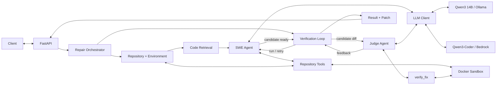

# swe_agent

`swe_agent` is a repository-level software-repair agent that combines code retrieval, bounded tool use, Docker-isolated execution, explicit verification, and independent patch evaluation.

Given a Git repository and an issue description, the system retrieves relevant code, lets an LLM-driven agent inspect and modify the repository, verifies candidate fixes inside a restricted Docker environment, sends the candidate to a separate judge agent, and records the resulting patch and run artifacts.

The project supports both local inference with Qwen3 through Ollama and hosted inference through Amazon Bedrock.

> This is an experimental AI/software-engineering project, not a production-ready autonomous coding service.

## Architecture



The repair pipeline handles repository preparation, retrieval, model interaction, tool execution, testing, verification, patch generation, and artifact persistence.

A shared `LLMClient` abstraction allows the same agent and judge implementation to use either local or hosted inference.

## Repair workflow

A repair run follows a bounded workflow:

1. clone or copy the target repository into a temporary workspace
2. prepare a repository-specific execution environment
3. parse and index the repository
4. retrieve code relevant to the issue
5. let the repair agent inspect, search, edit, and test the repository
6. require command-based verification after modifications
7. pass the candidate patch and evidence to a separate judge
8. verify the selected command against the original and patched repository states
9. save the final Git diff, metadata, model outputs, and run artifacts

The agent does not receive unrestricted host access. Repository interaction is exposed through explicit tools, while shell commands execute inside Docker.

## Repository retrieval

Instead of placing an entire repository into the model context, `swe_agent` builds a bounded context from several retrieval signals.

The pipeline includes:

- Tree-sitter parsing for Python, JavaScript, TypeScript, Java, C, C++, Go, Rust, and C#
- semantic embeddings using `sentence-transformers/all-MiniLM-L6-v2`
- Chroma vector search
- lexical search
- heuristic symbol and call-pattern expansion
- weighted retrieval and reranking
- bounded context assembly

The call-pattern expansion is intentionally heuristic. It is not a complete language-aware static call graph.

The goal is to expose a small set of issue-relevant code while retaining useful structural context around retrieved symbols.

## Runtime isolation

Commands requested by the agent and verification system run inside Docker with restrictions including:

- network access disabled
- read-only container root filesystem
- dropped Linux capabilities
- `no-new-privileges`
- PID limits
- CPU limits
- memory limits
- restricted temporary writable storage through `tmpfs`

The target repository is mounted into the container so tests and verification commands can execute against it.

### Trust boundary

Repository-specific dependency installation happens earlier while preparing the execution image.

That build phase is a separate trust boundary from the restricted runtime container. Package installation and repository build scripts may execute code during image construction, and dependency resolution may require network access.

The runtime sandbox therefore reduces the capabilities available to commands executed during repair and verification, but image construction should **not** be considered safe for arbitrary untrusted repositories.

## LLM backends

The repair agent and judge use the same `LLMClient` abstraction.

| Mode | Backend | Model |
| --- | --- | --- |
| Local development / evaluation | Ollama | `qwen3:14b` |
| AWS deployment | Amazon Bedrock | `qwen.qwen3-coder-30b-a3b-v1:0` |

The recorded benchmark in this repository was produced using the local Qwen3 14B configuration.

It does not measure the Bedrock deployment.

### Local backend

PowerShell:

```powershell
$env:SWE_LLM_BACKEND = "ollama"
```

Linux/macOS:

```bash
export SWE_LLM_BACKEND=ollama
```

### Bedrock backend

PowerShell:

```powershell
$env:SWE_LLM_BACKEND = "bedrock"
```

Linux/macOS:

```bash
export SWE_LLM_BACKEND=bedrock
```

The AWS deployment also configures the region and model identifiers.

Bedrock access is provided through an EC2 IAM role rather than static AWS credentials stored in the application.

## Evaluation

The repository includes a small controlled benchmark designed to exercise the complete repair pipeline.

It contains six bug-fixing tasks, each executed three times, for a total of 18 recorded attempts.

For each attempt, the evaluation process:

1. starts from a fixed task state
2. confirms that the baseline checker fails
3. runs the repair agent
4. captures the generated Git patch
5. evaluates the patch independently from the agent's own verdict
6. executes a task-specific checker inside a restricted Docker container
7. records the outcome and artifacts

The independent checker is the primary scoring mechanism.

The judge agent's verdict is recorded separately and is **not** treated as ground truth.

### Recorded configuration

```text
Agent model:      qwen3:14b
Judge model:      qwen3:14b
Embedding model:  sentence-transformers/all-MiniLM-L6-v2
Attempts:         18
Time budget:      900 seconds per attempt
```

### Recorded results

| Task | Independent passes | Attempts |
| --- | ---: | ---: |
| `config-defaults` | 0 | 3 |
| `csv-output` | 0 | 3 |
| `inventory` | 3 | 3 |
| `merge-intervals` | 3 | 3 |
| `page-tokens` | 3 | 3 |
| `tag-order` | 2 | 3 |
| **Total** | **11** | **18** |

Across all 18 attempts:

- **11** passed the independent checker
- **6** failed the independent checker
- **1** produced a checker error

Independent-checker pass rate:

**61.1% (11/18)**

The judge agent was substantially less dependable as a source of final status during this run:

| Judge outcome | Attempts |
| --- | ---: |
| Incomplete verdict | 12 |
| `pass` | 2 |
| `fail` | 1 |
| No verdict | 3 |

This is one reason the project evaluates patches using an independent checker rather than relying on the judge's self-reported decision.

### Benchmark scope

These are deliberately small, controlled repository-repair tasks.

They are **not SWE-bench tasks**.

The recorded 61.1% result should therefore not be interpreted as a general software-engineering-agent success rate or compared directly with SWE-bench results.

The purpose of the benchmark is primarily to:

- exercise the complete repair pipeline
- expose failure modes
- compare system changes under fixed tasks
- separate judge behavior from independently verified patch behavior

Task fixture source files are available under:

```text
eval-repos/
```

Independent checkers are available under:

```text
eval-checks/
```

Recorded aggregate results and benchmark metadata are stored under:

```text
evaluation-results/
```

### Reproducibility note

The task source snapshots, checkers, evaluation code, aggregate results, and recorded metadata are included in the public repository.

The recorded evaluation originally used the fixture directories as independent Git repositories with their own exact commit histories. Those nested Git histories are not embedded in the main repository.

As a result, the benchmark inputs can be inspected publicly, but the current evaluation workflow still needs a small fixture-initialization change before the recorded run can be reproduced end-to-end from a completely fresh clone.

## FastAPI service

`api.py` exposes the repair pipeline through an asynchronous job API.

| Method | Endpoint | Purpose |
| --- | --- | --- |
| `GET` | `/health` | Liveness check |
| `POST` | `/jobs` | Submit a repair job |
| `GET` | `/jobs/{job_id}` | Read job status |
| `GET` | `/jobs/{job_id}/result` | Read the full result |
| `GET` | `/jobs/{job_id}/patch` | Download the generated patch |

Job endpoints require an `X-API-Key` header.

The current service allows one active repair job at a time and returns HTTP `409 Conflict` when another repair is already running.

Example:

```bash
curl -X POST http://127.0.0.1:8000/jobs \
  -H "X-API-Key: $SWE_API_KEY" \
  -H "Content-Type: application/json" \
  -d '{
    "repo_url": "https://github.com/example/project.git",
    "issue_text": "Describe the bug and expected behavior here."
  }'
```

## Local setup

### Prerequisites

- Python 3.12
- Docker
- Git
- Ollama

### 1. Create a virtual environment

```bash
python -m venv .venv
```

PowerShell:

```powershell
.\.venv\Scripts\Activate.ps1
pip install -r requirements-local.txt
```

Linux/macOS:

```bash
source .venv/bin/activate
pip install -r requirements-local.txt
```

### 2. Build the base sandbox image

```bash
docker build -t evolving-swe-sandbox:1.0 ./sandbox
```

### 3. Pull the local model

```bash
ollama pull qwen3:14b
```

Make sure the Ollama service is running before starting a repair.

### 4. Configure the backend

PowerShell:

```powershell
$env:SWE_LLM_BACKEND = "ollama"
```

Linux/macOS:

```bash
export SWE_LLM_BACKEND=ollama
```

### 5. Configure API authentication

The FastAPI service requires an API key containing at least 24 characters.

PowerShell:

```powershell
$env:SWE_API_KEY = "replace-with-a-long-random-api-key"
```

Linux/macOS:

```bash
export SWE_API_KEY="replace-with-a-long-random-api-key"
```

### 6. Start the API

```bash
uvicorn api:app --host 127.0.0.1 --port 8000 --workers 1
```

The service is then available at:

```text
http://127.0.0.1:8000
```

`requirements-local.txt` reflects the development environment used for the project. Exact compatibility may vary across operating systems.

## AWS deployment

The hosted configuration runs on an Ubuntu EC2 instance with:

- FastAPI managed by `systemd`
- Docker for repository execution and verification
- Amazon Bedrock for inference
- an EC2 IAM role granting Bedrock access
- the application bound to `127.0.0.1:8000`

Environment configuration:

```text
SWE_LLM_BACKEND=bedrock
AWS_REGION=eu-north-1
SWE_AGENT_MODEL=qwen.qwen3-coder-30b-a3b-v1:0
SWE_JUDGE_MODEL=qwen.qwen3-coder-30b-a3b-v1:0
```

Static AWS credentials are not stored in the application configuration.

### Access

The API is intentionally not exposed directly to the public Internet.

It is accessed through an SSH tunnel:

```bash
ssh -i /path/to/key.pem \
  -L 8000:127.0.0.1:8000 \
  ubuntu@EC2_PUBLIC_IP
```

After establishing the tunnel, the local client can use:

```text
http://127.0.0.1:8000
```

while traffic is forwarded to the service running on EC2.

## Project structure

```text
.
├── api.py
├── main.py
├── requirements-local.txt
├── requirements-server.txt
│
├── swe_agent/
│   ├── context/
│   ├── tools/
│   ├── swe_agent.py
│   ├── judge_agent.py
│   ├── llm_client.py
│   ├── verification.py
│   └── verification_loop.py
│
├── sandbox/
│   ├── Dockerfile
│   ├── docker_executor.py
│   ├── environment.py
│   └── runner.py
│
├── eval-repos/
├── eval-checks/
├── evaluation-results/
│   ├── manifest.json
│   └── results.csv
│
├── eval_runner.py
├── eval_tasks.py
└── evaluate_task.py
```

## Current limitations

Known limitations include:

- the evaluation suite is small and task-specific
- the recorded evaluation uses a relatively small local model
- judge verdict generation was unreliable in the recorded benchmark
- the published fixture snapshots do not currently preserve their original nested Git histories
- the API uses a single-worker, filesystem-backed job model
- only one repair job runs at a time
- repository setup may require network access
- dependency installation and repository build scripts may execute code during image construction
- runtime Docker restrictions do not make the image-build stage safe for arbitrary untrusted repositories
- the AWS deployment is private behind an SSH tunnel rather than a public HTTPS endpoint
- the published evaluation measures the local Qwen3 14B configuration rather than the Bedrock deployment

## Future work

Planned improvements include:

- making the published benchmark runnable end-to-end from a fresh clone
- adding baseline and ablation comparisons for retrieval and agent components
- improving judge reliability
- expanding the evaluation suite
- improving retrieval and reranking based on measured failures
- strengthening repository-setup isolation
- improving persistent job storage and concurrency
- evaluating the Bedrock configuration separately

A longer-term goal is to use the evaluation harness as a controlled optimization loop:

1. run the fixed benchmark
2. collect failed and incomplete attempts
3. classify failures across retrieval, tool use, patch generation, verification, and judging
4. modify one or more components
5. re-run the same benchmark
6. compare the new results against the previous configuration

This makes architectural changes measurable against fixed tasks and independent checkers rather than relying only on qualitative examples.

## Project focus

The main engineering focus of `swe_agent` is the full AI software-repair pipeline:

**repository retrieval → bounded tool use → code modification → isolated execution → explicit verification → independent evaluation → deployable inference backends**

The project is intended to explore reliable AI-assisted software repair, especially the engineering required around the model itself rather than model inference alone.
