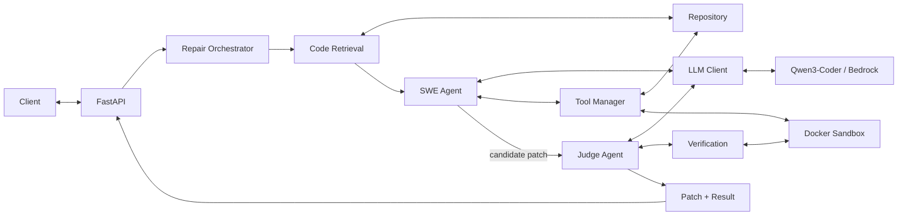

# Evolving SWE

Evolving SWE is a sandboxed software-repair agent for repository-level bug fixing. Given a repository and an issue description, it retrieves relevant code, uses tool calls to inspect and edit the repository, runs verification commands in Docker, asks a separate judge agent to review the candidate, and saves the resulting patch and run artifacts.

The project supports two LLM backends:

- **Local:** Qwen3 14B through Ollama
- **AWS:** Qwen3-Coder-30B-A3B-Instruct through Amazon Bedrock

The recorded evaluation results in this repository were produced with the local Qwen3 14B configuration. The AWS deployment is a separate hosted configuration.

## Architecture



## How it works

A repair run follows a bounded workflow:

1. Clone or copy the target repository into a temporary workspace.
2. Build a repository-specific execution environment.
3. Index the repository and retrieve code relevant to the issue.
4. Let the SWE agent inspect files, search code, edit files, and run commands.
5. Require command-based verification after edits.
6. Pass the candidate to a separate judge agent.
7. Re-run the same verification command against the original and patched repository.
8. Save the complete run result and Git diff as artifacts.

The agent is intentionally tool-driven: file changes and verification happen through explicit repository tools rather than unrestricted shell access from the model.

## Repository context

The context pipeline combines several signals rather than sending the whole repository to the model:

- Tree-sitter parsing for Python, JavaScript, TypeScript, Java, C, C++, Go, Rust, and C#
- semantic embeddings with `sentence-transformers/all-MiniLM-L6-v2`
- Chroma vector search
- lexical search
- dependency/call-graph expansion
- reranking and context assembly

This keeps the model prompt focused on a bounded set of code while still exposing structural relationships around the retrieved symbols.

## Sandboxing

Command execution and verification run in Docker with restricted runtime settings, including:

- no network access
- read-only container root filesystem
- dropped Linux capabilities
- `no-new-privileges`
- PID limits
- CPU and memory limits
- temporary writable storage through `tmpfs`

The repository itself is mounted into the container for execution. Dependency installation happens while preparing the repository-specific image, so image construction is a separate trust boundary from the network-disabled runtime container.

## LLM backends

The same `LLMClient` interface is used by both the SWE agent and judge.

| Mode | Backend | Model |
| --- | --- | --- |
| Local development / evaluation | Ollama | `qwen3:14b` |
| AWS deployment | Amazon Bedrock | `qwen.qwen3-coder-30b-a3b-v1:0` |

Select the backend with:

```text
SWE_LLM_BACKEND=ollama
```

or:

```text
SWE_LLM_BACKEND=bedrock
```

For Bedrock, the deployment also sets `AWS_REGION` and model environment variables. The EC2 instance uses an IAM role for Bedrock access rather than static AWS credentials.

## Evaluation

The benchmark contains six bug-fixing tasks, each repeated three times. For every attempt, the harness:

- checks out an exact starting commit
- confirms the baseline checker fails
- runs the repair agent
- captures the generated Git patch
- applies that patch to a fresh checkout
- executes an independent checker in a restricted Docker container

The final score is based on this independent checker, not on the judge agent's own verdict.

The recorded evaluation used:

```text
Agent model:      qwen3:14b
Judge model:      qwen3:14b
Embedding model:  sentence-transformers/all-MiniLM-L6-v2
Attempts:         18
Time budget:      900 seconds per attempt
```

### Results

| Task | Independent passes | Attempts |
| --- | ---: | ---: |
| `config-defaults` | 0 | 3 |
| `csv-output` | 0 | 3 |
| `inventory` | 3 | 3 |
| `merge-intervals` | 3 | 3 |
| `page-tokens` | 3 | 3 |
| `tag-order` | 2 | 3 |
| **Total** | **11** | **18** |

Across all 18 attempts:

- **11** passed the independent checker
- **6** failed the independent checker
- **1** produced a checker error

This is an independent-checker pass rate of **61.1% (11/18)** on this small benchmark.

The judge layer was less reliable than the patch generator in this run: it returned an incomplete verdict on 12 attempts, `pass` on 2, `fail` on 1, and no verdict on 3. That is why the benchmark reports independently re-applied and re-tested patches as the primary result.

These tasks are small, controlled repository repairs. They are not SWE-bench results and should not be interpreted as a general software-engineering benchmark.

Aggregate results and the evaluation manifest are stored under `evaluation-results/`.

## FastAPI service

`api.py` exposes the repair pipeline as an asynchronous job API.

| Method | Endpoint | Purpose |
| --- | --- | --- |
| `GET` | `/health` | Liveness check |
| `POST` | `/jobs` | Submit a repair job |
| `GET` | `/jobs/{job_id}` | Read job status |
| `GET` | `/jobs/{job_id}/result` | Read the full result |
| `GET` | `/jobs/{job_id}/patch` | Download the generated patch |

Job endpoints use an `X-API-Key` header. The service currently allows one active repair job at a time and returns HTTP 409 when another job is already running.

Example request:

```bash
curl -X POST http://127.0.0.1:8000/jobs \
  -H "X-API-Key: $SWE_API_KEY" \
  -H "Content-Type: application/json" \
  -d '{
    "repo_url": "https://github.com/example/project.git",
    "issue_text": "Describe the bug and expected behavior here."
  }'
```

## Local setup

### Prerequisites

- Python 3.12
- Docker
- Git
- Ollama for local inference

Create an environment and install the local dependencies:

```bash
python -m venv .venv
```

PowerShell:

```powershell
.\.venv\Scripts\Activate.ps1
pip install -r requirements-local.txt
```

Linux/macOS:

```bash
source .venv/bin/activate
pip install -r requirements-local.txt
```

Build the base sandbox image:

```bash
docker build -t evolving-swe-sandbox:1.0 ./sandbox
```

Pull the local model:

```bash
ollama pull qwen3:14b
```

Set the local backend:

```text
SWE_LLM_BACKEND=ollama
```

For API use, also set an API key of at least 24 characters and start Uvicorn:

```bash
uvicorn api:app --host 127.0.0.1 --port 8000 --workers 1
```

`requirements-local.txt` reflects the development environment used for this project; exact package compatibility may vary across platforms.

## AWS deployment

The hosted version runs on an Ubuntu EC2 instance with:

- the FastAPI service managed by `systemd`
- Docker for repository execution
- Amazon Bedrock for inference
- an EC2 IAM role for Bedrock permissions
- the API bound to `127.0.0.1:8000`

The deployment uses:

```text
SWE_LLM_BACKEND=bedrock
AWS_REGION=eu-north-1
SWE_AGENT_MODEL=qwen.qwen3-coder-30b-a3b-v1:0
SWE_JUDGE_MODEL=qwen.qwen3-coder-30b-a3b-v1:0
```

The API is intentionally not exposed directly to the public Internet. It is accessed through an SSH tunnel:

```bash
ssh -i /path/to/key.pem \
  -L 8000:127.0.0.1:8000 \
  ubuntu@EC2_PUBLIC_IP
```

After the tunnel is established, the client can use `http://127.0.0.1:8000` locally while requests are forwarded to the EC2 service.

## Project structure

```text
.
├── api.py
├── main.py
├── requirements-local.txt
├── requirements-server.txt
├── sandbox/
│   ├── Dockerfile
│   ├── docker_executor.py
│   ├── environment.py
│   └── runner.py
├── swe_agent/
│   ├── context/
│   ├── tools/
│   ├── swe_agent.py
│   ├── judge_agent.py
│   ├── llm_client.py
│   ├── verification.py
│   └── verification_loop.py
├── tests/
├── eval-checks/
├── eval_runner.py
├── eval_tasks.py
├── evaluate_task.py
└── evaluation-results/
    ├── manifest.json
    └── results.csv
```
## Future work

A planned extension is an **optimization cycle** around the repair pipeline.

The idea is to use evaluation results as structured feedback for improving the system iteratively:

1. run the repair benchmark
2. collect failed and incomplete attempts
3. analyze where the pipeline failed — retrieval, tool use, patch generation, verification, or judging
4. adjust prompts, retrieval/reranking, tool policies, or verification logic
5. re-run the same fixed evaluation suite
6. compare the new results against the previous configuration

This would turn the current evaluation harness into a repeatable optimization loop rather than using it only for final measurement.

The goal is not to let the agent modify itself without control, but to make changes measurable and reproducible against fixed tasks, commits, checkers, and runtime settings.

## Current limitations

Current limitations include:

- the local evaluation is constrained by relatively small model, which can limit both patch quality and judge reliability
- the evaluation set is small and task-specific
- the API uses a single-worker, filesystem-backed job model
- only one repair job runs at a time
- repository setup can require network access while building the per-repository Docker image
- the current AWS deployment is private behind an SSH tunnel rather than a public HTTPS endpoint
- the published evaluation measures the local Qwen3 14B configuration, not the Bedrock deployment
- the local benchmark fixture repositories used for the recorded evaluation are not committed to the public repository

The main engineering focus of the project is the repair pipeline itself: repository retrieval, bounded tool use, isolated execution, explicit verification, reproducible artifacts, and deployable model backends.
